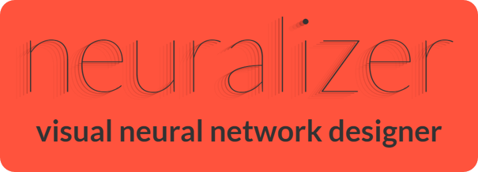

# Neuralizer
[Neuralizer.ai - Visual Neural Network Designer](https://www.neuralizer.ai "Neuralizer.ai - Visual Neural Network Designer")

Neuralizer is an online tool designed to function as a simple and visual common language for building neural networks.
In Neuralizer, the topology is built as a flow graph, which can be later exported to the top machine learning frameworks.
Topologies can be shared and reused as building blocks in more complex models.
Neuralizer has a version control system which simplifies working in groups and extending models by the community.